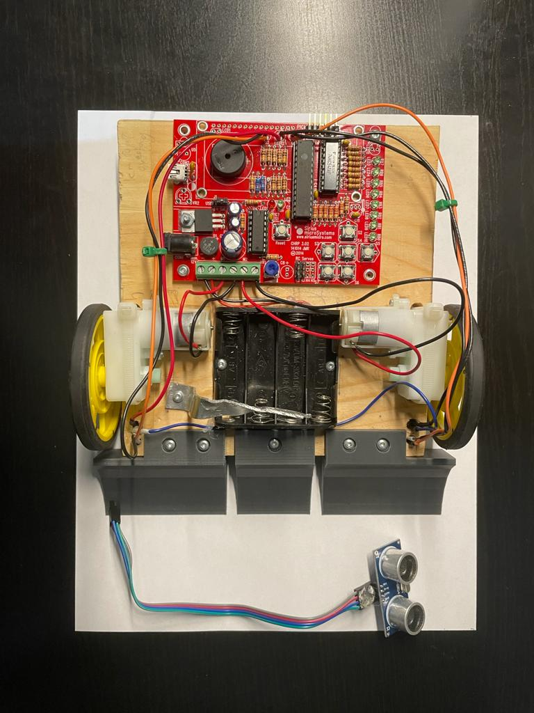
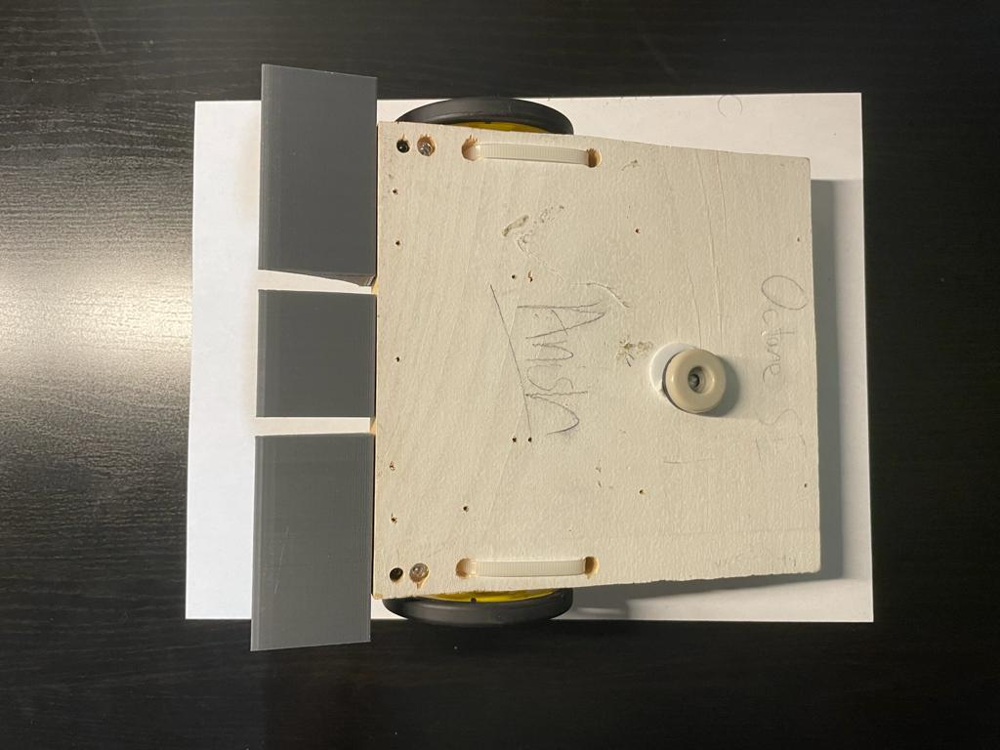
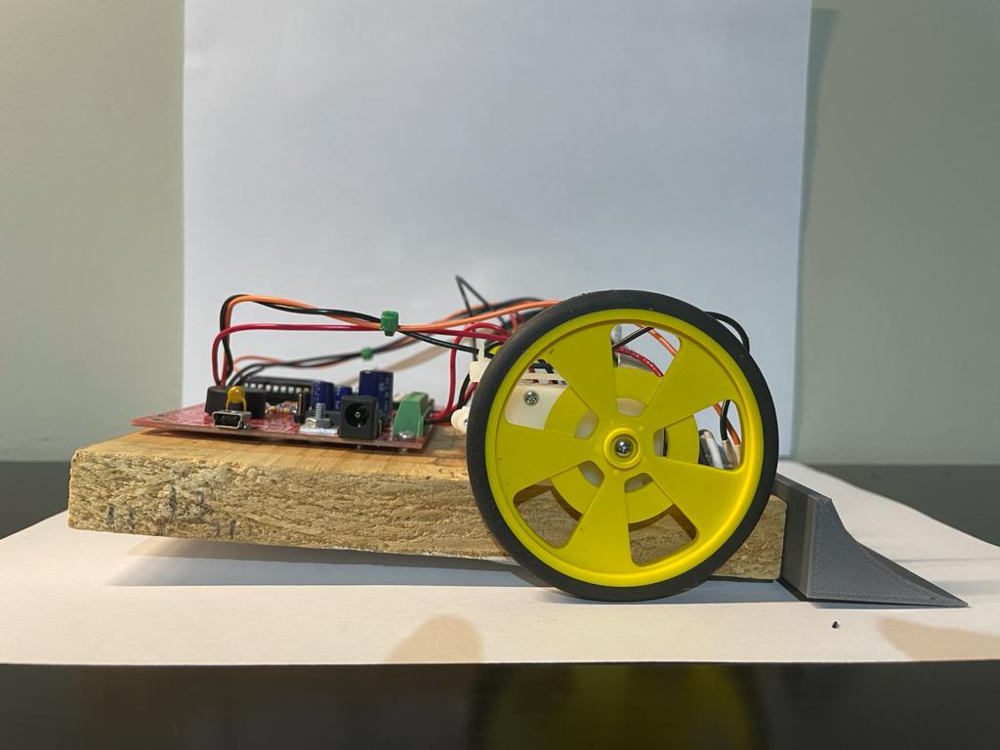
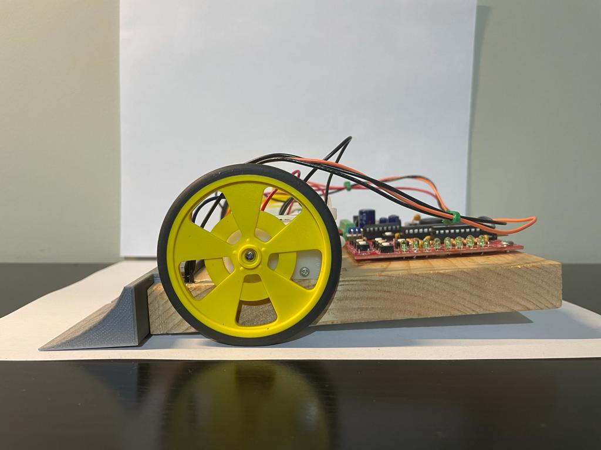

# SumoBot
**Timeframe**: Grade 10

**Language**: C

The code for my sumo bot, a project for my TEJ2OI tech course in grade 10.

---
**This bot uses**:

* A CHRP3 pcb, custom designed by my tech teacher [Mr. Rampelt](https://www.siriusmicro.com/index.html), containing a few microcontrollers, LEDs, buttons, a piezo beeper, space for an LCD screen, and more. This is all powered by 4 AA batteries.
* 2 servo motors
* A sonar sensor
* And a few 3D printed attatchments

---
**Pictures**:

Top Side:

Under Side:

Right Side:

Left Side:

